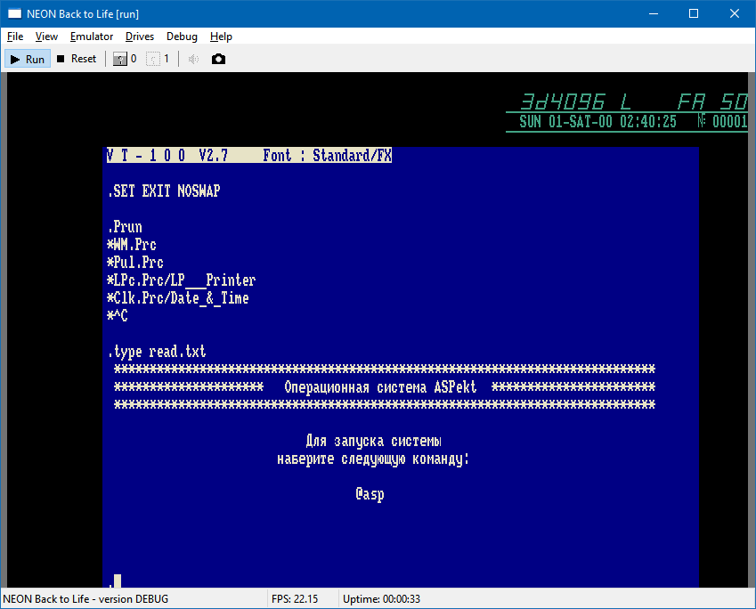

# neonbtl
**Neon Back to Life!** is an emulator of Soviet computer **Sojuz-Neon PK 11/16**.
This computer was manufactured in 1991-1992 at the "Kvant" plant in Zelenograd (near Moscow), and a total of 200-1000 units were produced.

Soyuz-Neon is based on the N1806VM2 processor, so it is partially compatible with machines such as DVK, UKNC, NEMIGA, and in general inherits the instruction set and architecture from the DEC PDP-11 line of machines.

Emulator status: Work in progress.

### Neon Back to Life!

**Neon Back to Life!** — это эмулятор советского компьютера [Союз-Неон ПК-11/16](https://ru.wikipedia.org/wiki/%D0%A1%D0%BE%D1%8E%D0%B7-%D0%9D%D0%B5%D0%BE%D0%BD_%D0%9F%D0%9A-11/16).
Этот компьютер выпускался в 1991-1992 годах на заводе "Квант" в г. Зеленограде, всего было выпущено 200-1000 экземпляров.

Союз-Неон построен на процессоре Н1806ВМ2, поэтому он частично совместим с такими машинами как ДВК, УКНЦ, Немига, и в целом наследует систему команд и архитектуру от машин линейки DEC PDP-11.

Состояние эмулятора: В процессе разработки.

### Маппинг клавиатуры
Используется следующий маппинг клавиатуры Союз-Неон на клавиатуру PC:
 - <kbd>К1</kbd>..<kbd>К5</kbd> = <kbd>F1</kbd>..<kbd>F5</kbd>
 - <kbd>ПОМ</kbd> <kbd>УСТ</kbd> <kbd>ИСП</kbd> = <kbd>F6</kbd>..<kbd>F8</kbd>
 - <kbd>СБРОС</kbd> = <kbd>F11</kbd>, <kbd>СТОП</kbd> = <kbd>F12</kbd>
 - <kbd>АР2</kbd> = <kbd>Esc</kbd>, <kbd>ЗБ</kbd> = <kbd>Backspace</kbd>
 - <kbd>Таб</kbd> = <kbd>Tab</kbd>, <kbd>ВВОД</kbd> = <kbd>Enter</kbd>
 - <kbd>НР</kbd> = <kbd>LShift</kbd>, <kbd>УПР</kbd> = <kbd>LCtrl</kbd>
 - <kbd>АЛФ</kbd> = <kbd>RShift</kbd>, <kbd>ГРАФ</kbd> = <kbd>RCtrl</kbd>

### Благодарности
Спасибо всем, кто оказал помощь и поддержку в создании этого эмулятора:
* Александр Холодов AKA xolod
* Алексей Кислый AKA Alex_K
* Андрей Титов AKA Titus
* другие участники форума zx-pk.ru

Спасибо Михаилу Гусеву за предоставленный экземпляр Союз-Неон!

### Ссылки

* [Техническое описание](http://www.emuverse.ru/wiki/%D0%A1%D0%BE%D1%8E%D0%B7-%D0%9D%D0%B5%D0%BE%D0%BD_%D0%9F%D0%9A-11/16_%D0%A2%D0%9E) в Emuverse
* [Документация на персональную ЭВМ ПК-11/16](https://github.com/troosh/pk11-16/tree/master/)
* Архив файлов по Союз-Неон: http://mirrors.pdp-11.ru/_pk11-16/
* Используемая на Союз-Неон кодировка: [Основная кодировка](https://ru.wikipedia.org/wiki/%D0%9E%D1%81%D0%BD%D0%BE%D0%B2%D0%BD%D0%B0%D1%8F_%D0%BA%D0%BE%D0%B4%D0%B8%D1%80%D0%BE%D0%B2%D0%BA%D0%B0)

Видео:
* [Союз-Неон: самый желанный компьютер | Демодуляция 2022](https://www.youtube.com/watch?v=g0wQQ4NY5vc)
