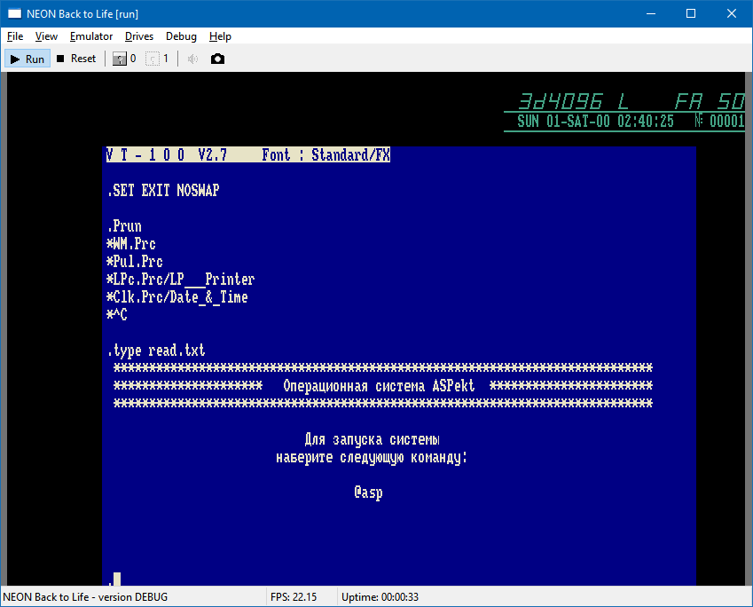
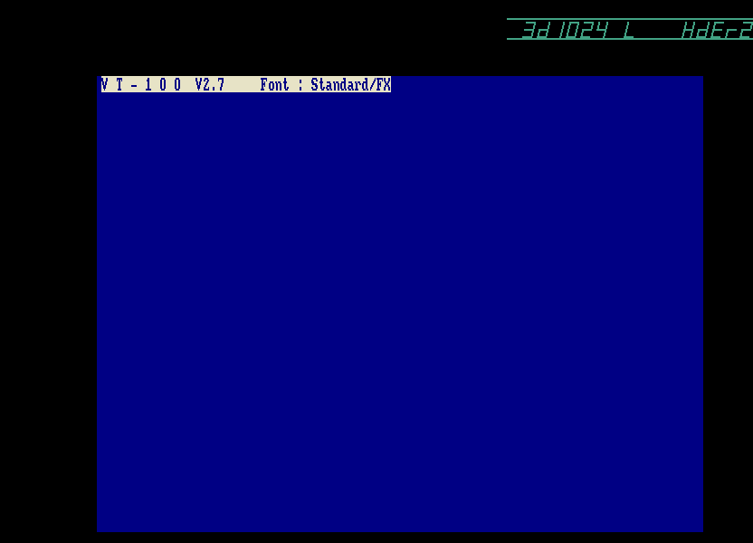
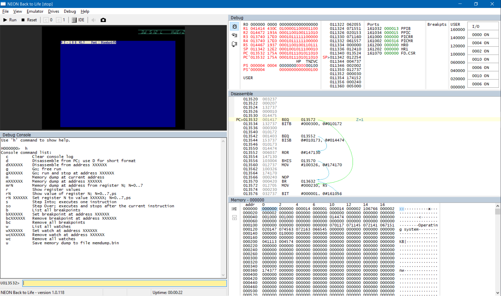

# NeonBTL emulator User Manual

## Intro

**Neon Back to Life!** (**NeonBTL**) — is an emulator of the Soviet computer **Soyuz-Neon PK-11/16** (**Союз-Неон ПК-11/16** in Russian, hereinafter just **Soyuz-Neon**). This computer was manufactured in 1991-1992 at the "Kvant" plant in Zelenograd (near Moscow), and a total of 200-1000 units were produced.

Soyuz-Neon is based on the N1806VM2 (Н1806ВМ2) processor, so it is partially compatible with machines such as DVK, UKNC, NEMIGA, and in general inherits the instruction set and architecture from the DEC PDP-11 line of machines.

The purpose of the NeonBTL emulator is to provide as complete emulation as possible of the computer, its devices, and peripherals in order to preserve knowledge about Soyuz-Neon. The emulator allows programs created for Soyuz-Neon to run on modern computers, even if you don't have a real instance of this device. Also, the emulator has many other features that can be used for debugging programs and other purposes.

This guide mainly refers to the Windows version of the NeonBTL emulator. There is a version of the emulator written in Qt, which uses the same emulation core but has a slightly different interface.


## Installation and Launch

Download the latest version of the emulator.
The list of distributions available for download can be found at: https://github.com/nzeemin/neonbtl/releases.
Download the ZIP file of the distribution named NeonBTL-XXX.zip.

The emulator is supplied in the form of an archive with binary files. Unzip the archive to an empty folder.

To run the emulator, run the `NeonBTL.exe` file.



The emulator is designed to work on desktop versions of Windows, such as Windows XP, Windows Vista, Windows 7, etc. The amount of RAM used during operation depends on the selected screen mode.


## Usage

### Launching the emulator

Launching the emulator is done using the *Emulator* > *Run* menu command. For convenience, this command is also available on the toolbar. The same command can be used to stop the emulator, and the next time the Run command is issued, execution will resume from the same point.

During operation, the emulator may consume a significant portion of the CPU time.
The emulator is single-threaded, so it only loads one CPU core.

Resetting the emulator to its initial state can be done using the *Emulator* > *Reset* menu command. This is equivalent to pressing the reset button on a real machine. It is not necessary to stop the emulator to perform a reset.

After starting the emulator, you will see how the Sojuz-Neon tests the RAM, and immediately after that, the computer will try to boot, first from the MFM hard drive and then from the floppy disk.

This is what the screen looks like after the memory test:




### Command line

The emulator uses the following command-line options during startup:

 * `/autostart` `/autostarton` — Turn on emulation auto-start
 * `/noautostart` `/autostartoff` — Turn off the auto-start
 * `/debug` `/debugon` `/debugger` — Turn on the debugger
 * `/debugoff` `/nodebug` — Turn off the debugger
 * `/sound` `/soundon` — Turn on the sound
 * `/nosound` `/soundoff` — Turn off the sound
 * `/diskN:filePath` — Attach the floppy disk image, N=0..1
 * `/hard:filePath` — Attach the hard drive image

Keys are processed sequentially one after the other, so if conflicting keys are used, the one specified later applies.


### Keyboard layout
The following mapping of the Soyuz-Neon keyboard to the PC keyboard is used:
 - <kbd>К1</kbd>..<kbd>К5</kbd> = <kbd>F1</kbd>..<kbd>F5</kbd>
 - <kbd>ПОМ</kbd> <kbd>УСТ</kbd> <kbd>ИСП</kbd> = <kbd>F6</kbd>..<kbd>F8</kbd>
 - <kbd>СБРОС</kbd> = <kbd>F11</kbd>, <kbd>СТОП</kbd> = <kbd>F12</kbd>
 - <kbd>АР2</kbd> = <kbd>Esc</kbd>, <kbd>ЗБ</kbd> = <kbd>Backspace</kbd>
 - <kbd>Таб</kbd> = <kbd>Tab</kbd>, <kbd>ВВОД</kbd> = <kbd>Enter</kbd>
 - <kbd>НР</kbd> = <kbd>LShift</kbd>, <kbd>УПР</kbd> = <kbd>LCtrl</kbd>
 - <kbd>АЛФ</kbd> = <kbd>RShift</kbd>, <kbd>ГРАФ</kbd> = <kbd>RCtrl</kbd>


### Booting from a floppy disk

To boot from a floppy disk, it must first be "inserted into the floppy drive".
Soyuz-Neon has two disk drives, `FD0` and `FD1`.
To attach a disk image, select *Drives* > *Floppy FD0:* (or click the floppy disk icon on the toolbar), a standard file selection dialog will appear.
Usually disk images for Soyuz-Neon have the `.dsk` extension.

To boot from the disk, reset the machine (*Reset*), or restart the emulator, and then press *Run*.
After the memory test, Soyuz-Neon attempts to boot from disk `FD0`.

If the selected disk is a bootable disk, you will see the boot process.
If the disk is not bootable, an error message like `?BOOT-U-No boot on volume` (`?BOOT-U-!Файл монитора не найден`) will be displayed.

To disconnec the floppy diskette select *Drives* > *Floppy FDx:* again or click on the floppy diskette in the toolbar.


### Working in RT-11

The operating system used on the Soyuz-Neon is RT-11. Therefore, for a more in-depth understanding of working with the Soyuz-Neon, it makes sense to study the manuals for working with RT-11.

To get a list of files on a disk, use the DIR command. For example, to get a list of files on the FD0 disk, enter the command:
```
DIR FD0:
```
To copy files in RT-11, use the COPY command. For example, to copy the file "FILE1.TXT" from the current disk to the FD1 disk, enter the command:
```
COPY FILE1.TXT FD1:
```
When specifying the file name, you can use wildcards, for example, to copy all files:
```
COPY *.* FD1:
```

```***TODO***```


### Built-in debugger

The built-in debugger can be turned on/off with the command *View* > *Debug*.



On the one hand, the debugging mode is a tool for the emulator developer. The debugger allows you to go to the desired location in the code and execute it step by step, controlling the correctness of the operation of all functions. On the other hand, the debugger allows emulator users to see the program operation in detail.

In the upper left is the screen of the Soyuz-Neon computer. In the lower left is the debug console, where commands can be entered; a brief list of commands is displayed by typing `h`. In the upper right is the window showing the current processor state: the registers are in the box at the top, the stack contents are to the right of them, and below them is the disassembled block at the PC address. To the right of the upper right is the state of the ports. In the lower right is the memory state window.

The memory cells that have changed after the next step or run are highlighted in red everywhere. Before the step or run, the state of the entire memory and processor registers is saved, which allows you to determine if each cell has changed.

The list of commands of the debugging console is displayed by the `h` command:
```
  c          Clear console log
  d          Disassemble from PC; use D for short format
  dXXXXXX    Disassemble from address XXXXXX
  g          Go; free run
  gXXXXXX    Go; run and stop at address XXXXXX
  m          Memory dump at current address
  mXXXXXX    Memory dump at address XXXXXX
  mrN        Memory dump at address from register N; N=0..7
  r          Show register values
  rN         Show value of register N; N=0..7,ps
  rN XXXXXX  Set register N to value XXXXXX; N=0..7,ps
  s          Step Into; executes one instruction
  so         Step Over; executes and stops after the current instruction
  b          List all breakpoints
  bXXXXXX    Set breakpoint at address XXXXXX
  bcXXXXXX   Remove breakpoint at address XXXXXX
  bc         Remove all breakpoints
  w          List all watches
  wXXXXXX    Set watch at address XXXXXX
  wcXXXXXX   Remove watch at address XXXXXX
  wc         Remove all watches
  u          Save memory dump to file memdump.bin
```

*c* — Clear the debug console log.

*r* — Show the contents of the registers.
*r1* — Show the contents of register R1.
*r1 1000* or *r1=1000* — Change the value of register R1 to 1000.

*m* — Dump memory from the current address.
*m1000* — Dump memory from address 1000.
*mr1* — Dump memory from the address in register R1.

*d1000* — Disassemble several instructions starting from address 1000.

*g* — Start the emulator, equivalent to the command *Emulator* > *Run*.
*g1000* — Set a breakpoint at address 1000 and start the emulator.

*s* — Debugger step.

*so* — Debugger step with subroutine skip: the disassembler calculates the address of the next instruction, sets a breakpoint on the next instruction, and starts the emulator.

*u* — Save a memory dump to the `memdump.bin` file.


### Settings

The settings window is opened by the command *File > Settings*:

* *Sound volume* — the volume of the sound (when it is turned on)

The settings are stored in a text file with the same name as the emulator executable file, but with the extension ".ini". So for `NeonBTL.exe`, the settings file will be named `NeonBTL.ini`. The settings file is created automatically upon the first launch of the emulator. In addition to the settings from the *Settings* window, the settings file stores the position of the emulator window and other settings.


## Applications

### Books
 * [Documentation for DEC RT-11 (PDF), in English](http://www.bitsavers.org/pdf/dec/pdp11/rt11/)

### Links
 * [Союз-Неон ПК-11/16 in Russian Wikipedia](https://ru.wikipedia.org/wiki/%D0%A1%D0%BE%D1%8E%D0%B7-%D0%9D%D0%B5%D0%BE%D0%BD_%D0%9F%D0%9A-11/16)
 * [Союз-Неон ПК-11/16 in Emuverse](http://www.emuverse.ru/wiki/%D0%A1%D0%BE%D1%8E%D0%B7-%D0%9D%D0%B5%D0%BE%D0%BD_%D0%9F%D0%9A-11/16)
 * [Emulator repo NeonBTL in GitHub](https://github.com/nzeemin/neonbtl)
 * [Repo with some documents on Soyuz-Neon](https://github.com/troosh/pk11-16/tree/master/Docs)
 * [Soyuz-Neon software collection at Hobot's](https://archive.pdp-11.org.ru/vid/PK11_NEON/)
 * [Soyuz-Neon software collection at pdp-11.ru](http://mirrors.pdp-11.ru/_pk11-16/)

