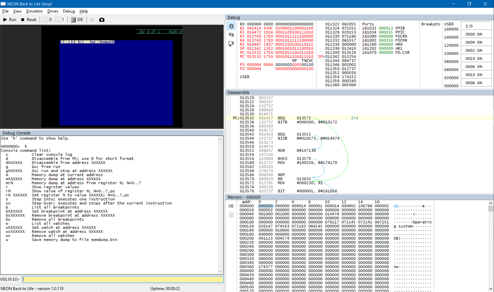

# Руководство пользователя эмулятора NeonBTL

## Введение

**NeonBTL** — это эмулятор советского компьютера **Союз-Неон ПК-11/16** (далее просто **Союз-Неон**). Этот компьютер выпускался в 1991-1992 годах на заводе "Квант" в г. Зеленограде, всего было выпущено 200-1000 экземпляров.

Союз-Неон построен на процессоре Н1806ВМ2, поэтому он частично совместим с такими машинами как ДВК, УКНЦ, Немига, и в целом наследует систему команд и архитектуру от машин линейки DEC PDP-11.

Назначение эмулятора NeonBTL заключается в насколько возможно полной эмуляции компьютера, его устройств и периферии, с целью сохрания знаний о Союз-Неон. Эмулятор предоставяет возможность запуска программ, созданных для Союз-Неон, на современных компьютерах, даже если у вас нет реального экземпляра этого устройства. Также, эмулятор обладает многими дополнительными функциями, которые могут быть использованы для отладки программ и других целей.

Данное руководство относится в основном к Windows-версии эмулятора NeonBTL. Существует версия эмулятора, написанная под Qt, ядро эмуляции используется то же самое, интерфейс несколько отличается.

## Установка и запуск

Скачайте последнюю версию эмулятора.
Список дистрибутивов для скачивания находится по адресу: https://github.com/nzeemin/neonbtl/releases.
Скачайте ZIP-файл дистрибутива с именем NeonBTL-XXX.zip

Эмулятор поставляется в виде архива с бинарными файлами. Разархивируйте архив в пустую папку.

Для запуска эмулятора запустите файл `NeonBTL.exe`.

```***TODO***: Скриншот экрана```

Эмулятор предназначен для работы под управлением "настольных" версий Windows: Windows XP, Windows Vista, Windows 7 и т. д. Использование оперативной памяти при работе зависит от выбранного режима экрана.

## Использование

### Запуск эмулятора

Запуск эмулятора в работу выполняется командой меню *Emulator* > *Run*. Для удобства эта команда вынесена на панель инструментов. Та же команда выполняет останов эмулятора; при следующей команде Run выполнение продолжится с того же места.

При работе эмулятор может потреблять значительную часть процессорного времени.
Эмулятор однозадачный, поэтому нагружает только одно процессорное ядро.

Сброс эмулятора в исходное состояние выполняется командой *Emulator* > *Reset*. Это соответствует нажатию кнопки сброса на реальной машине. Для выполнения сброса не требуется останавливать эмулятор.

После запуска эмулятора, вы увидите как Союз-Неон тестирует оперативную память, и сразу после этого компьютер будет пытаться загрузиться, сначала с MFM-винчестера и затем с дискеты.

Так выглядит экрана после тестирования памяти:


### Загрузка с дискеты

```***TODO***```

### Работа в RT-11

Операционная система, используемая на Союз-Неон — это RT-11. Поэтому, для более глубокого знакомства с работой на УКНЦ имеет смысл изучать руководства по работе в RT-11.

Для получения списка файлов на диске, используйте команду DIR. Например, чтобы получить список файлов на диске FD0, введите команду:
```
DIR FD0:
```
Для копирования файлов в RT-11 используйте команду COPY. Например, чтобы скопировать файл "FILE1.TXT" с текущего диска на диск FD1, введите команду:
```
COPY FILE1.TXT FD1:
```
При указании имени файла можно использовать маски, например, для копирования всех файлов:
```
COPY *.* FD1:
```

```***TODO***```

### Встроенный отладчик

Встроенный отладчик включается/отключается по команде *View* > *Debug*.



С одной стороны, отладочный режим — это инструмент для разработчика эмулятора. Отладчик даёт возможность перейти к нужному месту в коде и выполнить его по шагам, контролируя правильность работы всех функций. С другой стороны, отладчик позволяет пользователям эмулятора детально изучить работу программы.

Слева вверху — экран Союз-Неон. Слева внизу — отладочная консоль, в которой можно вводить команды; краткий список команд выдается по команде h. Справа вверху — окно состояния текущего процессора: вверху в боксе его регистры, справа от них содержимое стека, ниже дизассемблированный блок возле адреса PC; правее вверху — состояние портов, внизу — состояние каналов обмена данными между процессорами. Справа внизу — окно состояния памяти.

Красным цветом везде отмечены ячейки памяти, которые изменились после очередного шага или прогона. Перед шагом/запуском сохраняется состояние всей памяти и регистров процессоров, что позволяет о каждой ячейке сказать, изменилась ли она.

Список команд отладочной консоли выдается по команде 'h':
```
  c          Clear console log
  d          Disassemble from PC; use D for short format
  dXXXXXX    Disassemble from address XXXXXX
  g          Go; free run
  gXXXXXX    Go; run and stop at address XXXXXX
  m          Memory dump at current address
  mXXXXXX    Memory dump at address XXXXXX
  mrN        Memory dump at address from register N; N=0..7
  r          Show register values
  rN         Show value of register N; N=0..7,ps
  rN XXXXXX  Set register N to value XXXXXX; N=0..7,ps
  s          Step Into; executes one instruction
  so         Step Over; executes and stops after the current instruction
  b          List all breakpoints
  bXXXXXX    Set breakpoint at address XXXXXX
  bcXXXXXX   Remove breakpoint at address XXXXXX
  bc         Remove all breakpoints
  w          List all watches
  wXXXXXX    Set watch at address XXXXXX
  wcXXXXXX   Remove watch at address XXXXXX
  wc         Remove all watches
  u          Save memory dump to file memdump.bin
```

*c* — очистка лога отладочной консоли

*r* — показать содержимое регистров.
*r1* — показать содержимое регистра R1.
*r1 1000* либо *r1=1000* — изменить значение регистра R1 на 1000.

*m* — дамп памяти с текущего адреса.
*m1000* — дамп памяти с адреса 1000.
*mr1* — дамп памяти с адреса из регистра R1.

*d1000* — дизассемблировать несколько инструкций, начиная с адреса 1000.

*g* — пуск эмулятора, то же что команда Emulator > Run.
*g1000* — поставить точку останова на адрес 1000 и пуск эмулятора.

*s* — шаг отладчика.

*so* — шаг отладчика с обходом подпрограмм: дизассемблером вычисляется адрес следующей инструкции, ставится точка останова на следующую инструкцию и запускается эмулятор.

*u* — сохранение дампа памяти в файл `memdump.bin`.


### Настройки

Окно настройки открывается по команде *File > Settings*:

* *Sound volume* — громкость звука (когда он включен)

Настройки хранятся в текстовом файле, названном так же как исполнимый файл эмулятора, но с расширением ".ini". Так для `NeonBTL.exe` файл настроек будет называться `NeonBTL.ini`. Файл настроек создаётся автоматически при первом запуске эмулятора. Помимо настроек из окна Settings, файл настроек хранит расположение окна эмулятора и другие настройки.


## Приложения

### Раскладка клавиатуры
Используется следующий маппинг клавиатуры Союз-Неон на клавиатуру PC:
 - <kbd>К1</kbd>..<kbd>К5</kbd> = <kbd>F1</kbd>..<kbd>F5</kbd>
 - <kbd>ПОМ</kbd> <kbd>УСТ</kbd> <kbd>ИСП</kbd> = <kbd>F6</kbd>..<kbd>F8</kbd>
 - <kbd>СБРОС</kbd> = <kbd>F11</kbd>, <kbd>СТОП</kbd> = <kbd>F12</kbd>
 - <kbd>АР2</kbd> = <kbd>Esc</kbd>, <kbd>ЗБ</kbd> = <kbd>Backspace</kbd>
 - <kbd>Таб</kbd> = <kbd>Tab</kbd>, <kbd>ВВОД</kbd> = <kbd>Enter</kbd>
 - <kbd>НР</kbd> = <kbd>LShift</kbd>, <kbd>УПР</kbd> = <kbd>LCtrl</kbd>
 - <kbd>АЛФ</kbd> = <kbd>RShift</kbd>, <kbd>ГРАФ</kbd> = <kbd>RCtrl</kbd>

### Командная строка

```***TODO***```

### Литература
 * Архангельский Андрей Германович. «RT-11, Step by Step». — Москва, 1989. — http://www.az-libr.ru/Persons/0GN/fe16506c/Books/000/Toc.shtml
 * Л. И. Валикова, Г. В. Вигдорчик, А. Ю. Воробьев, А. А. Лукин. «Операционная система СМ ЭВМ РАФОС. Справочник». — М.: Финансы и статистика, 1984. — 207 с.
 * [Документация на DEC RT-11 (PDF), англ.](http://www.bitsavers.org/pdf/dec/pdp11/rt11/)

### Ссылки
 * [Союз-Неон ПК-11/16 в Википедии](https://ru.wikipedia.org/wiki/%D0%A1%D0%BE%D1%8E%D0%B7-%D0%9D%D0%B5%D0%BE%D0%BD_%D0%9F%D0%9A-11/16)
 * [Союз-Неон ПК-11/16 в Emuverse](http://www.emuverse.ru/wiki/%D0%A1%D0%BE%D1%8E%D0%B7-%D0%9D%D0%B5%D0%BE%D0%BD_%D0%9F%D0%9A-11/16)
 * [Репозиторий эмулятора NeonBTL в GitHub](https://github.com/nzeemin/neonbtl)
 * [Сборник документации на Союз-Неон ПК-11/16](https://github.com/troosh/pk11-16/tree/master/Docs)
 * [Сборник софта для Союз-Неон в хламнике Хобота](https://archive.pdp-11.org.ru/vid/PK11_NEON/)
 * [Сборник софта для Союз-Неон на pdp-11.ru](http://mirrors.pdp-11.ru/_pk11-16/)

